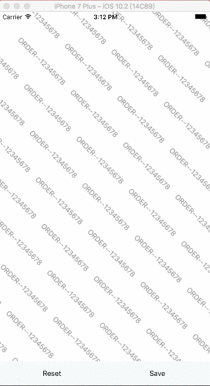

# react-native-signature-view

[](https://www.npmjs.com/package/react-native-signature-view)
[](https://travis-ci.org/zoomyu/react-native-signature-view)
[](https://www.npmjs.com/package/react-native-signature-view)
[](https://npmjs.org/package/react-native-signature-view "View this project on npm")

 SignatureView component for React Native (Android and iOS)

<p >
  
  
</p>

### Getting Started

`npm i --save react-native-signature-view`

### Mostly automatic installation

`react-native link react-native-signature-view`
### Manual installation
#### Android
Edit android/settings.gradle to look like this:

```diff
include ':app'

+ include ':react-native-signature-view'
+ project(':react-native-signature-view').projectDir = new File(rootProject.projectDir, '../node_modules/react-native-signature-view/android')
```

Edit android/app/build.gradle to look like this:
```diff
dependencies {
  compile fileTree(dir: "libs", include: ["*.jar"])
  compile "com.android.support:appcompat-v7:23.0.1"
  compile "com.facebook.react:react-native:+"  // From node_modules
+ compile project(':react-native-signature-view')
}
```

only RN 0.29+ Edit your MainApplication.java (deep in android/app/src/main/java/...) to look like this (note two places to edit):
```diff
+ import com.react_native_signature.RCTSignaturePackage;
...
  new MainReactPackage(),
+ new RCTSignaturePackage()
}
```

#### iOS
```diff
- Welcome iOS developer join, write this component together!
```

1. In XCode, in the project navigator, right click `Libraries` ➜ `Add Files to [your project's name]`
2. Go to `node_modules` ➜ `react-native-signature-view` and add `ios/RCTSignatureView.xcodeproj`
3. In XCode, in the project navigator, select your project. Add `libRCTSignatureView.a` to your project's `Build Phases` ➜ `Link Binary With Libraries`
4. Run your project (`Cmd+R`)<


### Properties

+ **signatureColor** : FontColor of the signature, you can use HEX or RGBA color codes

+ **watermarkString** : Content of the watermark

+ **watermarkSize** : FontSize of the watermark

+ **watermarkColor** : FontColor of the watermark, you can use HEX or RGBA color codes

+ **watermarkAngle** : Watermark rotation angle,

+ **watermarkLineSpacing** : Line spacing between watermarks

+ **watermarkWordSpacing** : Word spacing between watermarks

### Methods

+ **_saveSignature()** : when called it will save the signature and returns savePath on onSaveEvent() callback

+ **_resetSignature()** : when called it will clear the signature on the canvas

### Callback Props

+ **onSaveEvent** : Triggered when _saveSignature() is called, which return signature file path.

### Usage

To see all available function take a look at [root.js](https://github.com/zoomyu/react-native-signature-view/blob/master/example/src/root.js#L26)

```js
  <SignatureView
    ref={'sign'}
    style={{flex:1}}
    watermarkString={'ORDER--12345678'}
    watermarkSize={14}
    watermarkColor={'#888888'}
    signatureColor={'#000000'}
    watermarkLineSpacing={20}
    watermarkWordSpacing={10}
    watermarkAngle={45}
    onSaveEvent={(msg)=>{
      console.log('onSaveEvent --->>', msg);
    }}
  />
```

### License

[MIT](./LICENSE)
